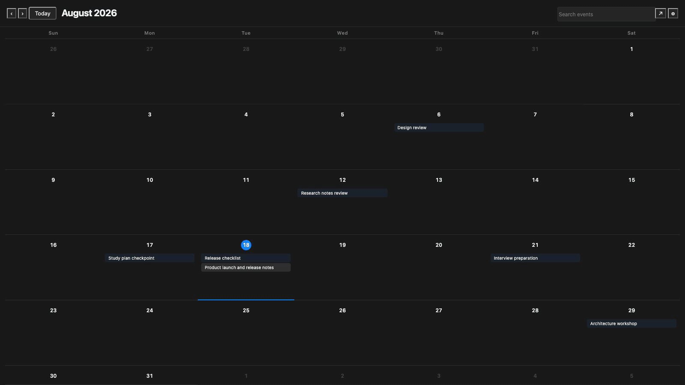
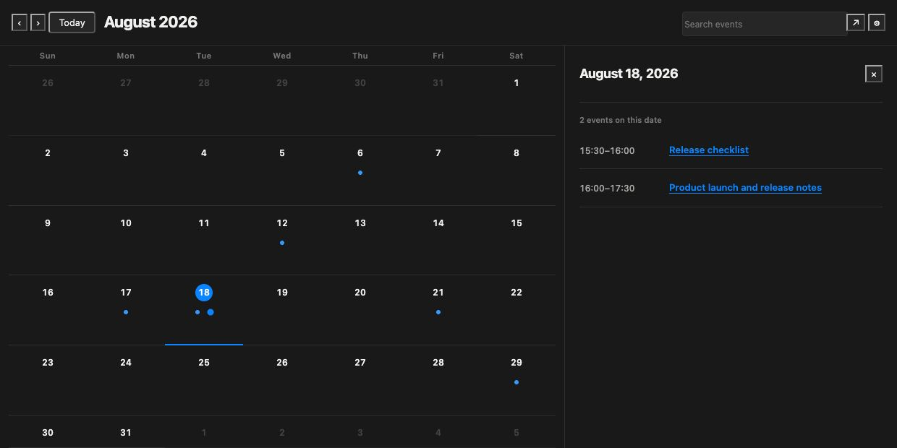
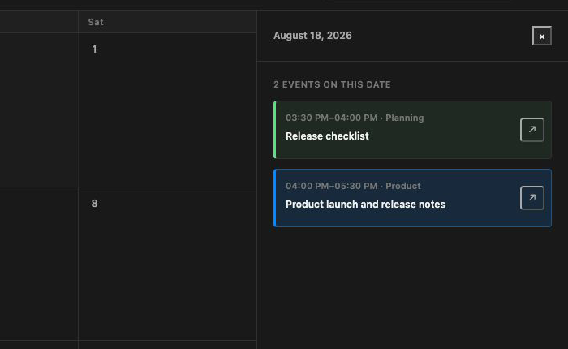

# Link Calendar Navigator

<p align="center">
  <a href="obsidian://show-plugin?id=link-calendar"></a>
  <a href="https://github.com/woonyong-kr/link-calendar/actions/workflows/ci.yml"></a>
  <a href="https://github.com/woonyong-kr/link-calendar/releases/latest"></a>
  <a href="LICENSE"></a>
</p>

<p align="center">
  <strong>See the dates you already wrote. Send only the sources you choose to Google Calendar for reminders.</strong>
</p>

Link Calendar Navigator finds explicit dates, periods, history entries, and deadlines already written in active Markdown bodies. Select a day to open the canonical note or inspect every note that mentioned the same timeline item. Dates from configured calendar-note folders can appear beside them without changing Markdown ownership.

**Markdown → automatic timeline → original note.** Optional sync adds **selected source → dedicated Google calendar** without changing the source of truth.





<p align="center">
  <a href="obsidian://show-plugin?id=link-calendar">Add to Obsidian</a>
  ·
  <a href="https://github.com/woonyong-kr/obsidian-navigator-demo-vault/releases/latest">Try the public demo Vault</a>
  ·
  <a href="https://community.obsidian.md/plugins/link-calendar">Community page</a>
</p>

## Why it feels different

- **Zero-setup timeline:** explicit timeline entries in active Markdown bodies are indexed automatically.
- **Markdown stays canonical:** the index is derived in memory; notes are never copied into a plugin database.
- **One item, all sources:** repeated mentions collapse into one timeline item with canonical and mentioning-note links.
- **Low-noise by default:** file timestamps, maintenance properties, and arbitrary prose dates never become events.
- **Read-only automation:** automatic results cannot rewrite source notes.
- **Optional controlled writing:** folder profiles can explicitly allow note creation and conflict-checked date moves.
- **Local by default:** no account or network request is used until Google Calendar is explicitly enabled and connected.

## Five-second start

1. Install **Link Calendar Navigator** from **Settings → Community plugins**.
2. Run **Open Link Calendar Navigator** or select the calendar ribbon icon.
3. Move between months, select an event title, and open its canonical Markdown.

That is enough for read-only navigation. Folder setup is optional and is needed only when you want a custom property mapping or explicitly writable calendar notes.

## Optional Google Calendar reminders

Google Calendar integration is off by default. When you enable it, one **Connect Google Calendar** action creates a dedicated **Link Calendar** in your account. You do not create an OAuth client or paste credentials.

1. Add or choose the folder sources whose mapped events may leave Obsidian.
2. Enable **Google Calendar** and connect your account in the browser.
3. Turn on only the source mappings you want, then select **Sync now**.

The first release is deliberately one-way: **configured Markdown source → dedicated Google calendar**. It creates or updates only events previously created by this plugin. Existing calendars, unrelated events, guests, and remote descriptions are outside its write boundary. Deleting a note never authorizes a remote deletion, and a Google-side edit stops a later overwrite as a conflict.

The dedicated calendar appears in Google Calendar on desktop and mobile, so its normal notifications remain available even when Obsidian is closed. Obsidian must be open when you run a sync; this release does not claim background or two-way synchronization.

Only the narrow `calendar.app.created` permission is requested. Refresh tokens stay in Obsidian `SecretStorage`; note bodies are not sent to the OAuth relay. See [Google Calendar privacy and security](docs/google-calendar.md) and the [privacy policy](PRIVACY.md).

## Two inputs, one timeline

The calendar accepts only two inputs: explicit timeline entries in Markdown bodies, and date properties from folders you deliberately configure as calendar sources. It never promotes file creation or modification timestamps.

### Markdown body

```markdown
- 2026-08-04 → 2026-08-17 · [[Kubernetes recovery]]
- 2026-08-24 → ongoing · [[KRAFTON application]]
- 2026-09-02 scheduled · [[Final interview]]
- 2026-09-03 14:00–15:30 scheduled · [[Design review]]
- 2026-09-10 deadline · [[Application]]
- 2026-08-25 · Result confirmed
```

Korean equivalents `진행 중`, `예정`, and `마감` work too. Explicit body entries accept 24-hour wall-clock values such as `14:00` and `14:00–15:30`; the agenda can display them in either 12-hour or 24-hour format. A single-date history entry must be a Markdown list item. Dates in arbitrary prose, YAML frontmatter, fenced or inline code, blockquotes, URLs, and HTML comments are not reinterpreted by the automatic index.

### Configured calendar sources

When a folder already uses date properties, add it once in plugin settings and map its start, end, title, time, and category fields. Only that configured source reads frontmatter; automatic Vault-wide indexing does not guess property names.

ISO dates such as `2026-09-02` and ISO date-times are supported. Invalid or reversed ranges are ignored rather than rewritten.

Time values are treated as wall-clock values: `2026-09-02T14:00:00+09:00` remains `14:00` when displayed in 24-hour mode. Link Calendar does not silently shift an authored time to the operating-system timezone. Choose **12-hour** or **24-hour** under **Calendar settings → Time format**; this changes presentation only.

## Deduplication and provenance

The same period can be repeated across a project note, a person note, and a career history:

```markdown
[[KRAFTON AI Engineer intern application]] · 2026-08-02 → 2026-08-27
```

Link Calendar Navigator uses one stable identity:

```text
canonical target + start date + end date + temporal kind
```

Matching entries become one calendar item. The selected-day panel shows the canonical note separately from the unique notes that mention it:

```text
KRAFTON AI Engineer intern application
2026-08-02 → 2026-08-27

Canonical note: KRAFTON AI Engineer intern application
Mentioned in 4 notes
```

Aliases and relative wikilinks resolve through Obsidian's metadata cache. Hidden folders and archival/reference folders such as `_sources`, `archive`, `backups`, and `retired` are excluded from automatic indexing and cannot become canonical targets, so old copies cannot inflate provenance or replace an active note.

## Month and agenda workflow

1. **Scan a month.** Compact one-line titles identify events, periods, history, and deadlines.
2. **Choose a day.** The agenda lists every item overlapping that date.
3. **Open the evidence.** Select the title for the canonical note, or a provenance link for a mentioning note.



Month navigation keeps the selected day and agenda synchronized. Multi-day periods remain visible on every overlapping day, while each cell stays bounded to three one-line titles plus a readable overflow row. Long titles end with an ellipsis; the full title remains available to assistive technology and as a tooltip.

## Navigation and accessibility

- Select a day or event title to open the agenda.
- Select an underlined title to open the canonical note.
- Press `Cmd/Ctrl + Enter` on a focused event title to open its note directly.
- Use arrow keys to move the selected day; `Enter` or `Space` opens its agenda.
- Press `Escape` to close the agenda and restore focus.
- Run **Reveal active note in calendar** to locate the current dated note.
- Select **Today** or run **Show today in Link Calendar Navigator** to return to the current date.
- Use search, source filters, and focus mode without changing Markdown.

The UI uses Obsidian semantic theme variables, supports narrow side panes and mobile layouts, and respects reduced motion and forced colors.

## Optional source profiles

Automatic indexing is read-only. Add a source profile only when you need different property names, folder/tag scoping, or controlled writes.

The guided source preview reports the exact folder, Markdown count, detected date properties, and matched-note count before setup. New profiles remain read-only until you explicitly enable **Writable**.

For an enabled writable profile, the plugin can:

- create a Markdown event note through Obsidian's public `Vault` API;
- move only the mapped start and end properties;
- offer one conflict-checked Undo after a successful move.

Before every move, it confirms that the file still belongs to the same writable profile and that the indexed dates still match. Concurrent changes stop the move instead of being overwritten. Automatic timeline items are never draggable.

## Embedded agenda

Embed a compact, read-only upcoming list with a `link-calendar` code block:

~~~markdown
```link-calendar
source: Learning
title: Learning calendar
```
~~~

`source` is an optional Vault folder prefix and `title` is optional display text.

## Privacy, performance, and limits

- All extraction and deduplication run locally inside Obsidian.
- The index stores derived event metadata only in memory and rebuilds from Markdown.
- The local calendar index has no persistent event database; optional Google sync stores only mapping IDs, ETags, and fingerprints needed for safe retries.
- With Google Calendar disabled, no note body, title, date, or path leaves the app.
- With Google Calendar enabled, only mapped event titles and start/end values are sent directly to Google Calendar during an explicit sync.
- The OAuth relay exchanges and refreshes Google tokens but does not store tokens, notes, events, or analytics.
- Automatic body reads are batched so Obsidian can render between batches.
- The test suite includes a 5,000-note automatic-index fixture.
- Explicit writable-profile ranges longer than 370 days are rejected as diagnostics.

Removing the plugin leaves every Markdown note and property intact.

## Troubleshooting

- **A date is missing:** use one of the explicit Markdown forms above or map the note folder as a calendar source. Dates in prose, code, quotes, URLs, comments, hidden paths, and archive/reference folders are intentionally ignored.
- **A maintenance date is missing:** this is intentional. `created`, `updated`, filesystem timestamps, and similar bookkeeping fields are not automatic events.
- **Repeated entries:** make each mention link to the same canonical note and use the same start, end, and temporal kind.
- **Create or drag is unavailable:** automatic items are read-only; enable a valid writable folder profile for mutations.
- **A move was rejected:** the Markdown changed after indexing or no longer matches the configured source.
- **Search shows no results:** clear the query and source filters to restore the month.
- **Google Calendar is unavailable:** update to a release build; development builds require `LINK_CALENDAR_GOOGLE_RELAY_URL` at build time.
- **A Google event was not overwritten:** check the sync summary. A remote ETag change is reported as a conflict instead of being replaced.
- **A deleted note remains in Google:** this is intentional. Remote deletion is never inferred from a missing local file.
- **The dedicated Google calendar was deleted:** sync stops instead of recreating it silently. Disconnect and connect again only if you want a new dedicated calendar.

## Installation and compatibility

Install from **Settings → Community plugins → Browse → Link Calendar Navigator**. The plugin supports Obsidian 1.13.0 or later on desktop and mobile.

For a manual release install, download `main.js`, `manifest.json`, and `styles.css` from the [latest release](https://github.com/woonyong-kr/link-calendar/releases/latest) into `.obsidian/plugins/link-calendar/`, then reload Obsidian.

## Support and development

- Read the [changelog](CHANGELOG.md), [roadmap](ROADMAP.md), and [design QA](docs/design-qa.md).
- Report a [bug or use case](https://github.com/woonyong-kr/link-calendar/issues/new/choose).
- Review the [contributing guide](CONTRIBUTING.md) and [security policy](SECURITY.md).

```bash
npm ci
npm run verify
```

`npm run verify` runs TypeScript, Obsidian lint, unused-code analysis, plugin and OAuth relay tests, DOM tests with coverage, visual-fixture checks, a production build, and release-policy validation.

## 한국어 요약

Link Calendar Navigator는 활성 Markdown 전체의 일정·기간·이력·마감을 자동으로 월간 시간축에 모읍니다. 같은 정본 링크와 기간이 반복되면 하나로 합치고, 상세 패널에서 정본과 언급 문서를 분리해 보여 줍니다. Markdown이 유일한 정본이며 자동 색인은 읽기 전용입니다. 선택 사항인 Google Calendar 연결은 기본적으로 꺼져 있고, 사용자가 고른 폴더 소스만 전용 Link Calendar로 단방향 동기화합니다.

## License

[MIT](LICENSE)
